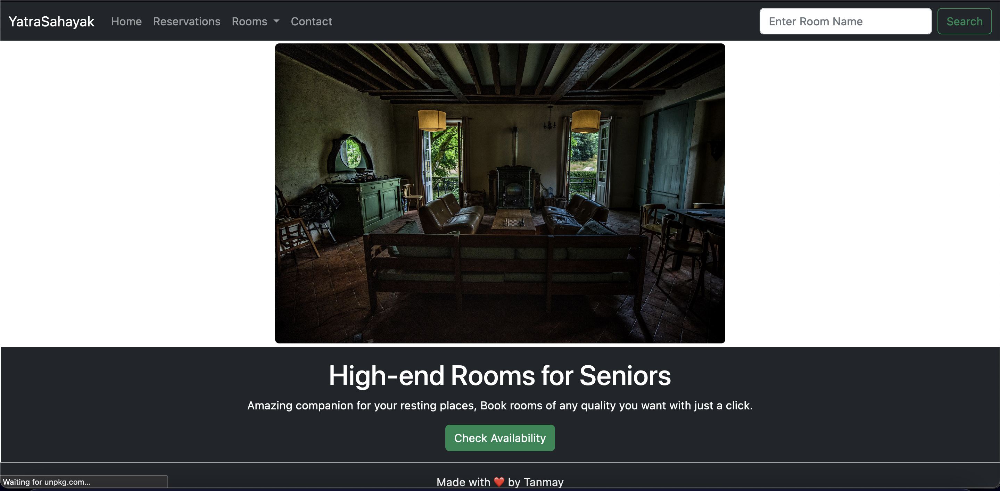
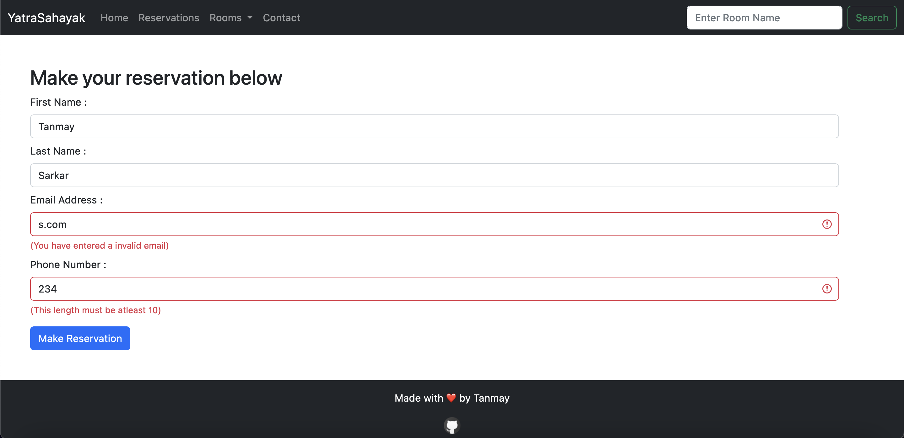
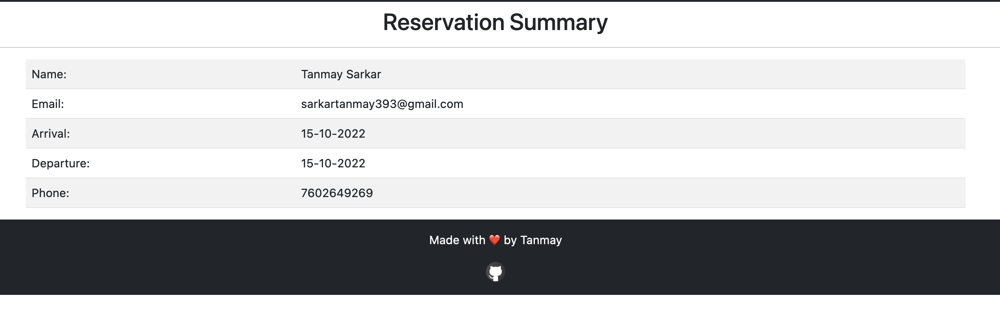
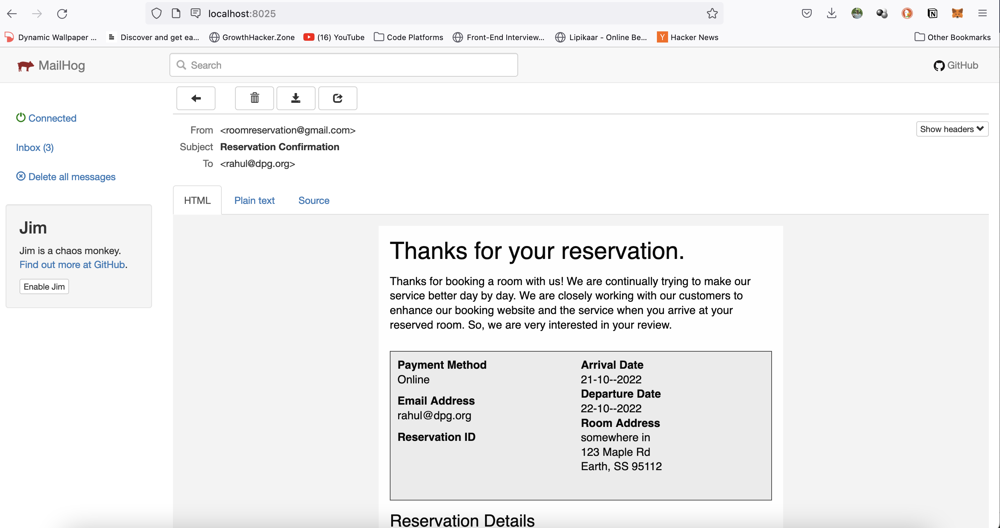

## Booking System - Golang based Web Application

- Built using Go 1.18.3
- Check room availability in desired dates.
- Form for complete reservation.
- Generate your reservation summary.

### Things I learned throughout -
1. Everything of Basic Web App.
2. Using [**nosurf**](https://github.com/justinas/nosurf) Middleware.
3. Using [**scs**](https://github.com/alexedwards/scs) Session Management.
4. HTML, CSS, JS, Bootstrap etc.
5. Server side validation using Golang.
6. Writing Test Functions in Golang.
7. Interacting with Database using Go.
8. DB Migration using Soda CLI.
9. Setting up Mail server using Go.
10. Sending mail as per user's requirement.

### Packages I Used -
1. "net/http"
2. "path/filepath"
3. "text/template"
4. "bytes"
5. "[github.com/go-chi/chi](https://github.com/go-chi/chi)"
6. "[github.com/justinas/nosurf](https://github.com/justinas/nosurf)"
7. "[github.com/alexedwards/scs/v2](https://github.com/alexedwards/scs/v2)"
8. "[notie](https://github.com/jaredreich/notie)" in JS
9. "[datepicker](https://github.com/mymth/vanillajs-datepicker)" in JS
10. "[github.com/asaskevich/govalidator](https://github.com/asaskevich/govalidator)"
11. "[github.com/xhit/go-simple-mail/v2](https://github.com/xhit/go-simple-mail/v2)"

### Screenshots

   
 <strong>Show</strong> 

 <strong><i>Highland Room Outlook</i></strong>

 <strong><i>Reservation Form Page</i></strong>

 <strong><i>Reservation Summary Page</i></strong>

 <strong><i>Reservation Email Outlook</i></strong>

